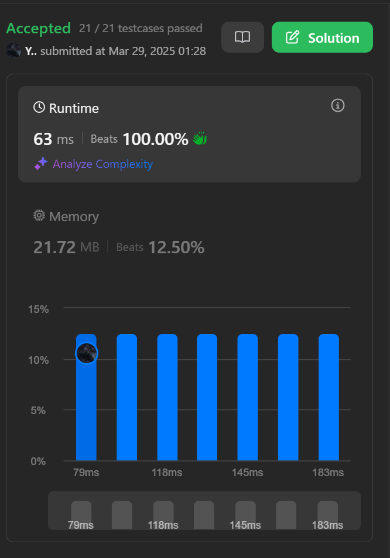

## Apprach 2 (Optimized Approach)

- Sort the queries in ascending order (You will know reason in the below points).
- We will recursively explore the grid starting from top-left corner
- Cells with value less than query are counted and marked visited
- Cells with value equal or greater than query are stored in Priority Queue
- The Priority Queue stores the values in increasing order so that when we access queries with higher value then we can use them instead of travelling again and again.

```
import (
	"container/heap"
	"sort"
)

type Cell struct {
	val, row, col int
}

type CellHeap []Cell

func (h CellHeap) Len() int            { return len(h) }
func (h CellHeap) Less(i, j int) bool  { return h[i].val < h[j].val }
func (h CellHeap) Swap(i, j int)       { h[i], h[j] = h[j], h[i] }
func (h *CellHeap) Push(x interface{}) { *h = append(*h, x.(Cell)) }
func (h *CellHeap) Pop() interface{} {
	old := *h
	n := len(old)
	x := old[n-1]
	*h = old[:n-1]
	return x
}

func maxPoints(grid [][]int, queries []int) []int {
	m, n := len(grid), len(grid[0])
	res := make([]int, len(queries))
	sortedQueries := make([][2]int, len(queries))
	for i, q := range queries {
		sortedQueries[i] = [2]int{q, i}
	}
	sort.Slice(sortedQueries, func(i, j int) bool {
		return sortedQueries[i][0] < sortedQueries[j][0]
	})
	total := 0
	var greaterCells CellHeap
	heap.Init(&greaterCells)
	var dfs func(query, row, col int)
	dfs = func(query, row, col int) {
		if row < 0 || col < 0 || row >= m || col >= n {
			return
		}
		if grid[row][col] > 0 {
			if grid[row][col] < query {
				total++
				grid[row][col] = -1
				dfs(query, row+1, col)
				dfs(query, row-1, col)
				dfs(query, row, col+1)
				dfs(query, row, col-1)
			} else {
				heap.Push(&greaterCells, Cell{grid[row][col], row, col})
				grid[row][col] = 0
			}
		}
		for greaterCells.Len() > 0 {
			top := greaterCells[0]
			if top.val < query {
				heap.Pop(&greaterCells)
				grid[top.row][top.col] = top.val
				dfs(query, top.row, top.col)
			} else {
				break
			}
		}
	}
	for _, qp := range sortedQueries {
		query, idx := qp[0], qp[1]
		dfs(query, 0, 0)
		res[idx] = total
	}
	return res
}

```

**Time Complexity:-**

- O(m _ n _ log(m\*n)), where m and n are grid dimensions
  **Space Complexity:-**
- O(m \* n)
