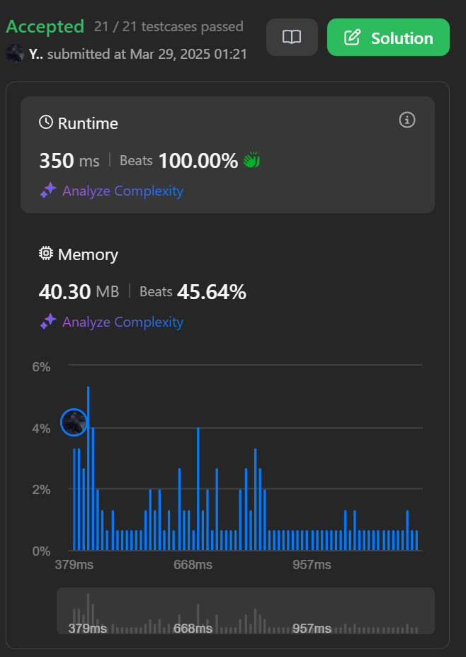

## Apprach 2 (Optimized Approach)

- Sort the queries in ascending order (You will know reason in the below points).
- We will recursively explore the grid starting from top-left corner
- Cells with value less than query are counted and marked visited
- Cells with value equal or greater than query are stored in Priority Queue
- The Priority Queue stores the values in increasing order so that when we access queries with higher value then we can use them instead of travelling again and again.

```
import heapq
from typing import List

class Solution:
    def maxPoints(self, grid: List[List[int]], queries: List[int]) -> List[int]:
        m, n = len(grid), len(grid[0])
        total = 0
        res = [0] * len(queries)
        sorted_queries = sorted([(q, i) for i, q in enumerate(queries)], key=lambda x: x[0])
        greater_cells = []

        def dfs(query: int, row: int, col: int):
            nonlocal total
            if row < 0 or col < 0 or row >= m or col >= n:
                return
            if grid[row][col] > 0:
                if grid[row][col] < query:
                    total += 1
                    value = grid[row][col]
                    grid[row][col] = -1
                    dfs(query, row + 1, col)
                    dfs(query, row - 1, col)
                    dfs(query, row, col + 1)
                    dfs(query, row, col - 1)
                else:
                    heapq.heappush(greater_cells, (grid[row][col], row, col))
                    grid[row][col] = 0

            while greater_cells and greater_cells[0][0] < query:
                value, r, c = heapq.heappop(greater_cells)
                grid[r][c] = value
                dfs(query, r, c)

        for query, idx in sorted_queries:
            dfs(query, 0, 0)
            res[idx] = total

        return res

```

**Time Complexity:-**

- O(m _ n _ log(m\*n)), where m and n are grid dimensions
  **Space Complexity:-**
- O(m \* n)
